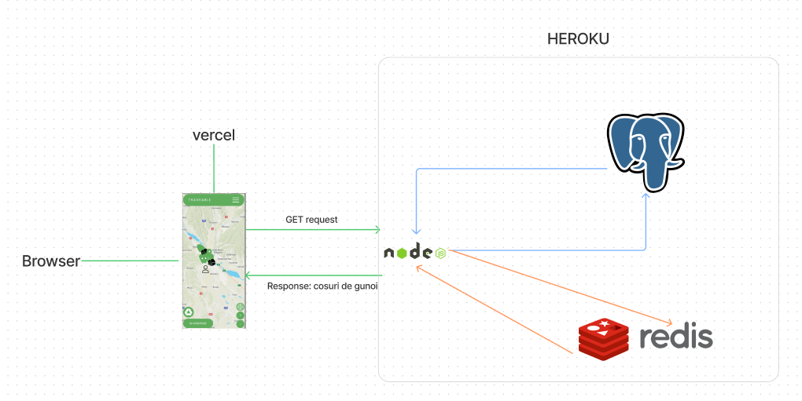

# Tech stack

## Backend || Server

- Baza de Date: Postgresql
- Cache: Redis
- Server: NodeJS, framework Express.js
  - Autentificare: Google & Discord OAUTH2.0
  - Testare automata(de tip functional) folosind Mocha(testing framework) si Chai(assert framework)
- Hosting: Heroku(free)

## Frontend || Aplicatie Web

- Este construit cu VueJS(v3)
- Pentru mapa LeafletJS
- Provider imagini mapa Mapbox
- Hosting: Vercel(free)

## De ce am ales aceste tehnologii?

- Autentificare cu Discord si Google:
  1.  Este mai sigur(nu stocam parole sau alte date sensibile despre utilizator)
  1.  Rata de spam este mult mai mica(Google si Discord au mult mai multe sanse sa descopere conturi spam sau duplicate decat noi)
- Postgres deoarece este o baza de date relationala foarte populara
- Redis deoarece este standardul pe industrie pentru caching
- NodeJS deoarece Javascript este un limbaj usor si aplicatia este IO-bound(task-ul nu este legat de cpu, ci de IO(trag date din postgres, trag date din redis, le trimit la utilizator)), lucru la care Node exceleaza
- Mocha si Chai deoarece sunt mult mai rapide ca Jest
- Vue deoarece este un framework popular si usor de invatat,iar fata de ReactJS are mai multe standarde incluse(de ex: router si vuex(state management))
- Leaflet deoarece este un framework popular pentru prelucare mape
- Mapbox ca provider deoarece ne permit sa costumizam mapa cu usurinta
